# 課題

ユーザーを検索してユーザー情報を表示するSPAを構築すること

## 内容

- Dev環境にある以下のAPIを利用すること
    - [https://dagss-dev-idp-je-fnc0201.azurewebsites.net/api/swagger/ui](https://dagss-dev-idp-je-fnc0201.azurewebsites.net/api/swagger/ui)
    - `/v1/Common/Users`
    - `/v1/Common/UserProfile`
- 画面は、検索＋一覧画面、ユーザーの詳細画面は最低限用意すること

## 制約

- Vue3 + ECMA Script 2020以降 を用いてSPAを構築すること
    - 画面はSFC（Vue）で記述すること
- Vue3はOption APIではなくComposition APIを使用すること
- HTMLは HTML Living Standardに準拠すること
- CSS・UI Frameworkは使用せず、SCSSを用いて自分で記述すること
    - ただし、リセット系のCSSライブラリはこの限りではない
    - また、Responsive対応は問わない
- 画面のレイアウト構成はヘッダ、サイドメニュー、コンテンツ部分と分けること
    - ヘッダ、およびサイドメニューはスティッキーである必要はない
    - それぞれをコンポーネント化し、検索＋一覧画面および詳細画面はコンテンツ部分で表示すること
    - flexboxの利用を推奨するがこの限りではない
    - 
        
- ユーザーの詳細画面は、ユーザーGUIDをURIに含めたURIとして設計すること
- テストケース・テストコードを作成すること。ユニットテストにはJestを利用すること
- エラーハンドリングを適切に行うこと
- Edge または Chromeの最新版で確認できること

## 注意事項

- APIへのアクセスはIP制限がかかっている
    - Global Protectを有効にするか、Azure Function APPのNetwork制限に自身のIPを登録すること
    - FunctionsをCallする時に必要な API Key `code` は別途教えてもらうこと
    - APIキーをRepositoryにPushしないこと（例: 環境変数や .envを利用すること）
- チーム開発を意識してコードを記述すること
    - Gitのコミットメッセージやコミット粒度など
    - 適切なコメント
- その他の注意事項はProductionコード準拠とし、DevDocを参照すること
    - [https://shiny-potato-eea8d29b.pages.github.io/](https://shiny-potato-eea8d29b.pages.github.io/)

# その他

- 課題に取りかかる前に、どのくらいかかりそうかの見積もりを提示すること
- **実務を想定して随時コミュニケーションを図ること**
- 通信など必要なライブラリは適宜packageに加えること
- mainブランチに直接pushはせずに、自分用のブランチを作成すること
- LinterにはESLint、FormatterにはPrettierを使用するように設定してある。VS Codeの拡張機能を連携すること

## ブランチ作成ルール

外部レポジトリにForkしないで当レポジトリで作業を行うこと

```
main
  ＼__ 各自の名前  # ここを各自のdevelop相当とする
          ＼__ PRのブランチ
          ＼__ ..
```

# project operations
## setup
```
npm ci
```

### 実行
```
npm run serve
```

### Compiles and minifies for production
```
npm run build
```

### Run your unit tests
```
npm run test:unit
```
